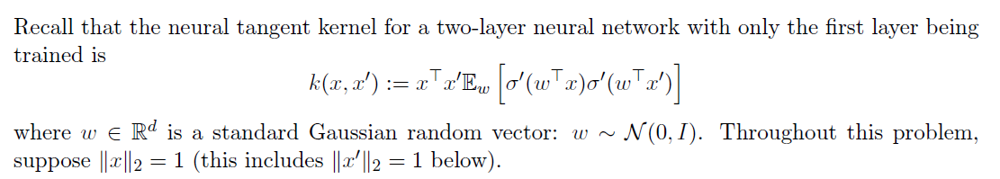
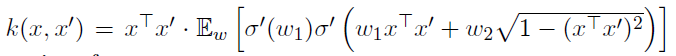
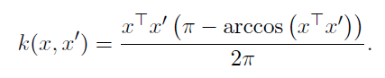
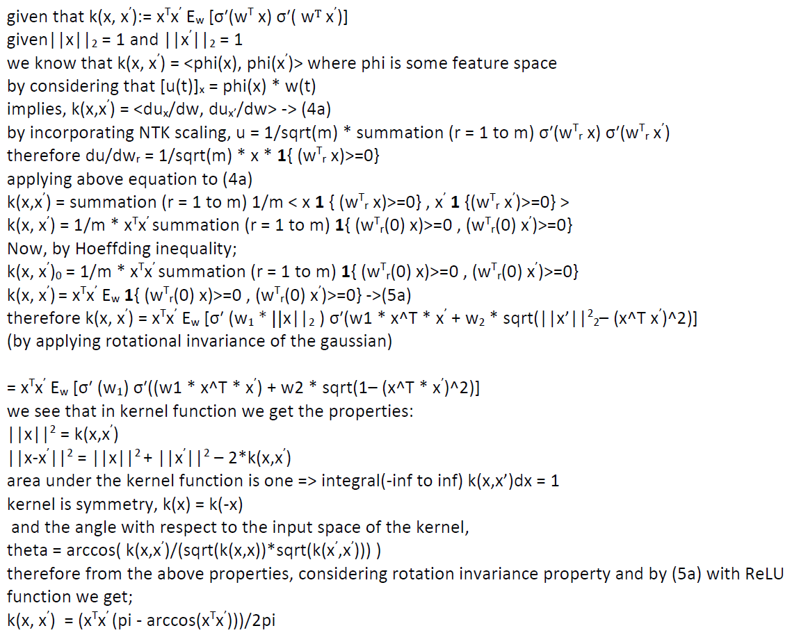
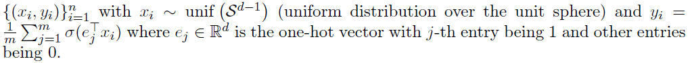
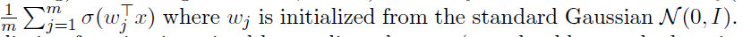
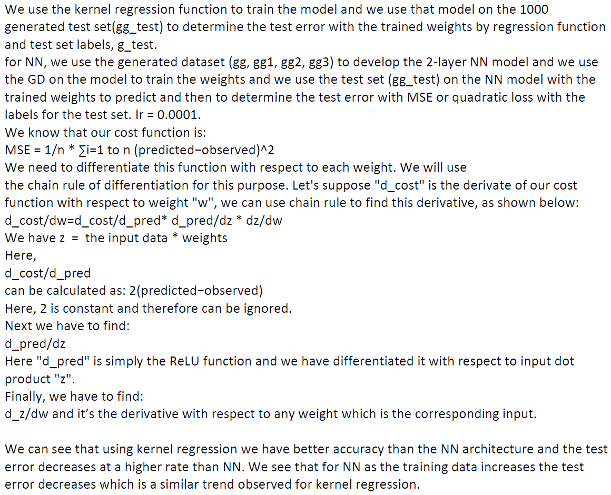

# neural-tangent-kernel-and-NN-on-uniformaly-distributed-generated-data

Neural Tangent Kernel

With first two entries of w as w1 and w2 we can prove  and when σ(·) is ReLU we can prove  and the proofs are shown below

We now fix d = 10 and m = 5 and generate n = 20, 40, 80, and 160 training data points 
We use two prediction functions to fit this data (1) kernel regression with the kernel function  (a.k.a., infinitely wide neural network with 1/√m initialization scaling) and no regularization, (2) a two-layer neural network with f(x;w1, . . . ,wm) = 
The two-layer neural network is trained by gradient descent with fine tuning the learning rate to make it
converge and we used quadratic loss. We then sampled another 1000 data to calculate the test error. We plotted the figure for the test errors of these two prediction functions (two curves) where x-axis is the number of training data and the y-axis is the test error.

